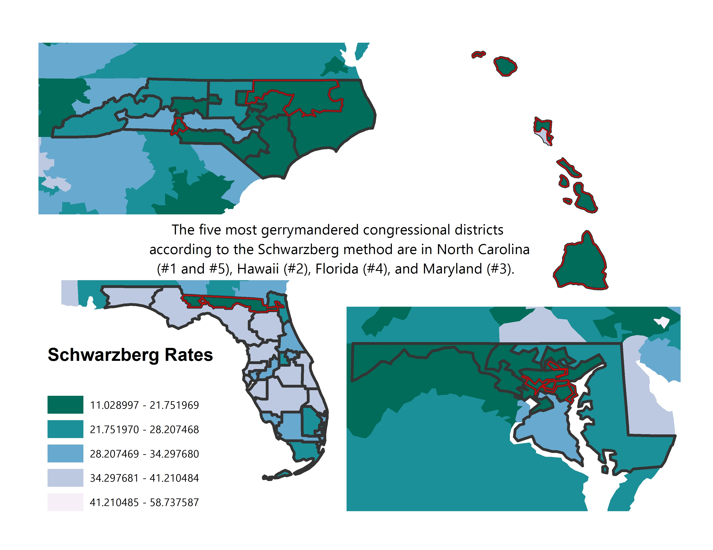

```{r setup, include=FALSE}
knitr::opts_chunk$set(echo = TRUE)
```


```{r message=FALSE, warning=FALSE}

library(tidyverse)
library(fiftystater)
library(gridExtra)
library(sf)
library(ggmap)

```

##Names

Lynda Chao, Nick McMullen, Justin Reis-Henrie, Hannah Shumway

##Workflow

- Hannah and Lynda: working with shapefiles and visualizations in GIS
- Nick and Justin: working with visualizations and CSV data in RStudio to help Hannah and Lynda pair the data in GIS
- All together: compiling work into shared Google Drive poster

- Meetings: Tuesday/Thursday at 11:30 AM

- The shared RMD will be compiled in a Github repository

##Topic and Research Questions

\textbf{Topic:} Gerrymandering Congressional Districts

\textbf{Research Questions:}

- Which states are, on average, most gerrymandered?
- Which states contain the top 5 most gerrymandered congressional districts?
- (Potential third research question) Which states contain the top 5 most gerrymandered state legislature districts and which party controls those state legislatures?


##Data

1. Average district gerrymandering (compactness and spread) metrics 

- Columns: State, Number of Districts, Polsby-Popper, Schwartzberg, Convex-Hull, Reock
- Limitations: data is on average by state and not on the Congressional District level
- Dimensions: 43 observations of 6 variables (did some data cleaning to add in states that only have one Congressional District)
- Most recent data for Congressional Districts

source: http://www.governing.com/gov-data/politics/gerrymandered-congressional-districts-compactness-by-state.html

```{r}

stateGerrymander <- read.csv("Data/StateGerrymandering.csv")

stateGerrymander <- stateGerrymander %>%
  mutate(Polsby.Popper = as.numeric(Polsby.Popper/100)) %>%
  mutate(Schwartzberg = as.numeric(Schwartzberg/100)) %>%
  mutate(Convex.Hull = as.numeric(Convex.Hull/100)) %>%
  mutate(Reock = as.numeric(Reock/100)) 


stateGerrymander$State <- as.character(stateGerrymander$State)

stateGerrymander <- stateGerrymander %>%
  rbind(c("Alaska", 1, 1, 1, 1, 1)) %>%
  rbind(c("Montana", 1, 1, 1, 1, 1)) %>%
  rbind(c("Delaware", 1, 1, 1, 1, 1)) %>%
  rbind(c("North Dakota", 1, 1, 1, 1, 1)) %>%
  rbind(c("South Dakota", 1, 1, 1, 1, 1)) %>%
  rbind(c("Vermont", 1, 1, 1, 1, 1)) %>%
  rbind(c("Wyoming", 1, 1, 1, 1, 1)) 

stateGerrymander$statelower <- tolower(stateGerrymander$State)

stateGerrymander$Polsby.Popper <- as.numeric(stateGerrymander$Polsby.Popper)
stateGerrymander$Schwartzberg <- as.numeric(stateGerrymander$Schwartzberg)
stateGerrymander$Convex.Hull <- as.numeric(stateGerrymander$Convex.Hull)
stateGerrymander$Reock <- as.numeric(stateGerrymander$Reock)

```


2. Congressional District Shapefile for 115th Congress 

- Not traditional data: we are working to attach gerrymander indices to the shapefile and visualize that way 
- Most recent data for Congressional Districts
- Source: US Census (census.gov)


3. Congressional District Compactness Data:

- PROBLEM: Doesn't have StateID or DistrictID to join with other data.

```{r}

cdCompact <- read.csv("https://raw.githubusercontent.com/jeffreyshen19/Is-My-District-Gerrymandered/master/data/master.csv")

```


4. Congressional District Raw Data - Area and Perimeter (but does not have comparable units with area and perimeter)

```{r}

congressDistrictRaw <- read.csv("Data/congressDistrictDataRaw.csv")

#Remove rows that are not congressional districts

congressDistrictRaw <- congressDistrictRaw %>%
  filter(!is.na(district_name))

#Calculate important metrics - unable to calculate Convex Hull and Reock w/o GIS - also, area and perimeter are in different units -- not sure which units -- this makes Polsby Popper calculations inaccurate, but Schwartzberg relies on a mere ratio, which we can use. 

congressDistrictRaw <- congressDistrictRaw %>%
  mutate(Schwartzberg = (2*pi*sqrt(area/pi)) / (perimeter))

```


5. State Legislative Districts 

- Columns: STATEFP, State, SLDLST, GEOID, NAMELSAD, Area, Perimeter, Polsby.Popper, Schwartzberg, Area.Convex.Hull, Reock
- Limitations: data is from 2014 not from most recent redraw of state legislature districts 
- Dimensions: 4825 observations 
- Source: https://raw.githubusercontent.com/cicero-data/compactness-stats/master/2014-us/state_lower.csv

```{r}

districtGerrymander <- read.csv("Data/districtGerrymander.csv")

```


##Initial Visualizations

### Research Question 1: State level gerrymandering indices


```{r}

ggplot(stateGerrymander, aes(x=State, y=Polsby.Popper))+ 
  geom_bar(stat="identity") + 
  theme(axis.text.x = element_text(angle=90))


polsby_popper_map <- ggplot(stateGerrymander, aes(map_id = statelower)) + 
  geom_map(aes(fill=Polsby.Popper), map=fifty_states) + 
  expand_limits(x=fifty_states$long, y=fifty_states$lat) + 
  coord_map() + 
  scale_x_continuous(breaks=NULL) + 
  scale_y_continuous(breaks=NULL) + labs(x = "", y= "") + 
  theme(legend.position="bottom", panel.background = element_blank()) + 
  labs(title="Mean Polsby-Popper Ratio")


```


Schwartzberg

```{r}

schwartzberg_map <- ggplot(stateGerrymander, aes(map_id = statelower)) + 
  geom_map(aes(fill=Schwartzberg), map=fifty_states) + 
  expand_limits(x=fifty_states$long, y=fifty_states$lat) + 
  coord_map() + 
  scale_x_continuous(breaks=NULL) + 
  scale_y_continuous(breaks=NULL) + labs(x = "", y= "") + 
  theme(legend.position="bottom", panel.background = element_blank()) + 
  labs(title="Mean Schwartzberg Ratio")


```


Convex Hull Map

```{r}

convex_hull_map <- ggplot(stateGerrymander, aes(map_id = statelower)) + 
  geom_map(aes(fill=Convex.Hull), map=fifty_states) + 
  expand_limits(x=fifty_states$long, y=fifty_states$lat) + 
  coord_map() + 
  scale_x_continuous(breaks=NULL) + 
  scale_y_continuous(breaks=NULL) + labs(x = "", y= "") + 
  theme(legend.position="bottom", panel.background = element_blank()) + 
  labs(title="Mean Convex-Hull Ratio")


```


Reock Ratio Map

```{r}

reock_map <- ggplot(stateGerrymander, aes(map_id = statelower)) + 
  geom_map(aes(fill=Reock), map=fifty_states) + 
  expand_limits(x=fifty_states$long, y=fifty_states$lat) + 
  coord_map() + 
  scale_x_continuous(breaks=NULL) + 
  scale_y_continuous(breaks=NULL) + labs(x = "", y= "") + 
  theme(legend.position="bottom", panel.background = element_blank()) + 
  labs(title="Mean Reock Ratio")

```


All 4 plots together

```{r}

grid.arrange(polsby_popper_map, schwartzberg_map, convex_hull_map, reock_map, nrow=2, bottom="Figure 1")

```


Comparing 5 worst states for each metric:

```{r}

stateGerrymander %>%
  arrange(Polsby.Popper) %>%
  head(5)

stateGerrymander %>%
  arrange(Schwartzberg) %>%
  head(5)

stateGerrymander %>%
  arrange(Convex.Hull) %>%
  head(5)

stateGerrymander %>%
  arrange(Reock) %>%
  head(5)

```


We observe the 5 worst states in Polsby.Popper to be the same as the Schwartzberg ratio. Convex-Hull and Reock, both measures of spread, differ in the worst 5 significantly. 

### Research Question 2: Top 5 Gerrymandered Congressional Districts

To help us understand how the compactness of Congressional districts is distributed generally, we made a histogram:

```{r}
ggplot(congressDistrictRaw, aes(x=Schwartzberg)) + geom_histogram()
```

This plot shows that district compactness is relatively normally distributed, with a peak near 0.3. This gives us a sense of where we expect would expect compactness to be for a typical district that isn't radically gerrymandered.


```{r}

Worst5 <- congressDistrictRaw %>%
  arrange(Schwartzberg) %>%
  head(5)

Worst5

```


States to investigate further and visualize:

- North Carolina
- Florida
- Maryland 
- Hawaii




We see that a district from Hawaii is included in this group. It is probably not reasonable to assume that a district in Hawaii is gerrymandered because the compactness index does not know that Hawaii is made up of a group of islands, so the district appears very spotty and purposefully drawn even though the boundaries are completely limited by the island boundaries. 

Moving forward, we want to compare another gerrymandering index to Schwartzberg (either Convex-Hull or Reock) using these GIS maps and compare which districts are selected as the most gerrymandered. This should hopefully give us a better understanding of which index is better and which districts stand out as likely the most gerrymandered. 


## Contributions

- Nick: Gathered all of the necessary data on gerrymandering indices for joining with shapefiles for GIS visualization, worked on visualizations in ggplot, read up on blogs/literature to help with analysis, helped with development of research questions

- Hannah: Joined CSV compactness data with GIS and worked on GIS visualizations, helped in discussion and development of research questions, found and formatted shapefiles data from Census website

- Lynda: Joined CSV compactness data with GIS and worked on GIS visualizations, helped in discussion and development of research questions, found and formatted shapefiles data from Census website

- Justin: Helped in discussion and development of research questions, worked on visualizations in ggplot, read up on blogs/literature to help with analysis


